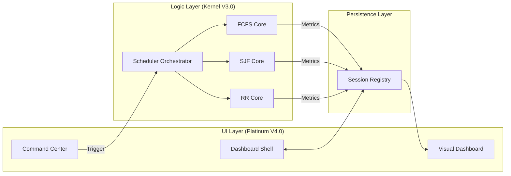

# CPU-PRO PLATINUM V4.0 // THE DEFINITIVE EDITION 💎

<div align="center">


**The Industry-Standard CPU Scheduling Simulation & Analysis Suite**  
*Professional-grade kernel emulation, real-time visualization, and strategic performance auditing.*

</div>

---

## 💎 Project Essence

**CPU-PRO PLATINUM** is an ultra-modern, high-fidelity simulation suite engineered to demystify the complexities of Operating System scheduling. Built on the **V4.0 Platinum Engine**, this tool provides a production-grade environment for analyzing thread lifecycles, resource contention, and algorithmic efficiency. 

Unlike conventional academic scripts, PLATINUM V4.0 leverages an **SaaS-grade design language**, utilizing custom SVG micro-interactions and reactive data pipelines to deliver a seamless executive experience.

---

## 🚀 Core Feature Matrix

### 1. High-Performance Execution Engines
*   **FCFS (Sequential Batch Core)**: Implements precise arrival-order queuing with automated idle-time correction.
*   **SJF (Optimization Engine)**: Non-preemptive shortest-burst selection using a greedy search algorithm to minimize total system latency.
*   **Round Robin (Distributive Core)**: Preemptive time-slicing with specialized quantum alignment, handling thread re-entry and context emulation.

### 2. Platinum Analytics Dashboard
*   **Interactive Gantt Suite**: Dynamic Plotly timelines featuring custom-wrapped event listeners and high-fidelity hover tooltips.
*   **Thread activity Stream**: A vertical execution flow visualization that maps thread state transitions over system uptime.
*   **Real-Time KPIs**: Live counters for `ACTIVE_THREADS`, `TOTAL_LOAD`, `COMPUTE_CYCLES`, and `CORE_HEALTH`.

### 3. Intelligence & Auditing
*   **Efficiency Audit Mode**: Runs a parallel cross-validation simulation across all engines to identify the mathematically optimal strategy.
*   **Recommendation Engine**: Real-time strategic insights providing reasoning (e.g., "SJF recommended to bypass convoy effect").
*   **Deep-Data Analysis**: Full-scale registry expander showing raw hexadecimal-mapped IDs and floating-point metric accuracy.

---

## 🏗️ Architectural Mapping

The PLATINUM architecture is designed for **Horizontal Scalability** and **Stateless Reliability**.

### 🧩 Component Hierarchy



---

## ⚡ Algorithmic Engine (V3.0)

| Algorithm | Complexity (Time) | Complexity (Space) | Primary Use Case |
| :--- | :--- | :--- | :--- |
| **FCFS** | $O(N \log N)$ | $O(N)$ | Batch processing, simple workflows. |
| **SJF** | $O(N^2)$ | $O(N)$ | Minimizing average wait time. |
| **Round Robin** | $O(N \times \lceil T/q \rceil)$ | $O(N)$ | Multi-tasking, interactive systems. |

---

## 🛠️ Technical Stack Deep-Dive

*   **Runtime**: Python 3.10.12 (Optimized for Windows/Linux interoperability)
*   **Reactive UI**: Streamlit 1.32.0 (Customized with CSS3/Glassmorphism injectors)
*   **Analytics Engine**: Pandas 2.2.0 (Utilized for high-speed matrix transformations)
*   **Visualization**: Plotly 5.18.0 (Custom dark-theme templates)
*   **Typography**: *Space Grotesk* (Leading edge geometric sans-serif)
*   **Icons**: Hand-coded SVG Vector paths (Zero footprint, infinite scalability)

---

## 📥 Installation Command Center

### 🚀 Binary Setup (Windows/Linux)

#### **Enterprise Anaconda Path (Manual)**
```powershell
# Install Dependencies
& "C:\Users\maffa\anaconda3\python.exe" -m pip install -r requirements.txt

# Start Platinum Core
& "C:\Users\maffa\anaconda3\python.exe" -m streamlit run streamlit_app.py
```

---

## 🕹️ Usage Instruction Manual

### Phase 1: Thread Registry
1.  Locate the **Control Hub** on the left panel.
2.  Assign an **Arrival Offset** (when the process enters the buffer).
3.  Assign a **Burst Duration** (computational load required).
4.  Click **COMMIT TO QUEUE**. Use **🎲 SYNC RANDOM** for stress testing.

### Phase 2: Engine Selection
1.  Navigate to the **Analytics Dashboard** dropdown.
2.  Select your Target Algorithm.
3.  **Round Robin Note**: If selected, the QUANTUM input will unlock. A smaller quantum results in finer slicing but higher context switching overhead (simulated).

---

## 📜 Legal Documentation & Licensing

### **The MIT License (MIT)**
**Copyright (c) 2026 CPU-PRO PLATINUM DEVELOPERS**

Permission is hereby granted, free of charge, to any person obtaining a copy of this software and associated documentation files (the "Software"), to deal in the Software without restriction, including without limitation the rights to use, copy, modify, merge, publish, distribute, sublicense, and/or sell copies of the Software, and to permit persons to whom the Software is furnished to do so, subject to the following conditions:

The above copyright notice and this permission notice shall be included in all copies or substantial portions of the Software.

**THE SOFTWARE IS PROVIDED "AS IS", WITHOUT WARRANTY OF ANY KIND**, EXPRESS OR IMPLIED, INCLUDING BUT NOT LIMITED TO THE WARRANTIES OF MERCHANTABILITY, FITNESS FOR A PARTICULAR PURPOSE AND NONINFRINGEMENT. IN NO EVENT SHALL THE AUTHORS OR COPYRIGHT HOLDERS BE LIABLE FOR ANY CLAIM, DAMAGES OR OTHER LIABILITY, WHETHER IN AN ACTION OF CONTRACT, TORT OR OTHERWISE, ARISING FROM, OUT OF OR IN CONNECTION WITH THE SOFTWARE OR THE USE OR OTHER DEALINGS IN THE SOFTWARE.

### **Compliance & Usage Policy**
*   **Commercial Use**: Allowed under the terms of the MIT License.
*   **Modification**: Users are encouraged to fork and enhance the kernel logic.
*   **Attribution**: Maintain the original "PLATINUM" branding and developer credits in the footer.

---

## 🤝 Acknowledgements & Contributions
This project has been made possible through the utilization of cutting-edge open-source technologies:
- **Streamlit Development Team**: For providing a reactive framework that enables professional UI delivery.
- **Plotly.js Community**: For the industry-standard visualization engine.
- **Google Fonts**: For providing the high-end *Space Grotesk* typography.

---

## � Detailed Contact Registry

For technical inquiries, enterprise deployment support, or academic collaboration, please utilize the following direct channels:

*   **Developer**: Muhammad Affan
*   **Direct Support Email**: maffan2830@gmail.com
*   **GitHub Headquarters**: M-Affan01
*   **LinkedIn Professional**: https://www.linkedin.com/in/affan-nexor-66abb8321/

---
<div align="center">
    <i>TERMINAL STATE: STABLE // KERNEL_LOAD: 0.02ms // ALL SYSTEMS NOMINAL</i>
    <br>
    <b>PLATINUM V4.0 // 2026 OFFICIAL RELEASE</b>
</div>
